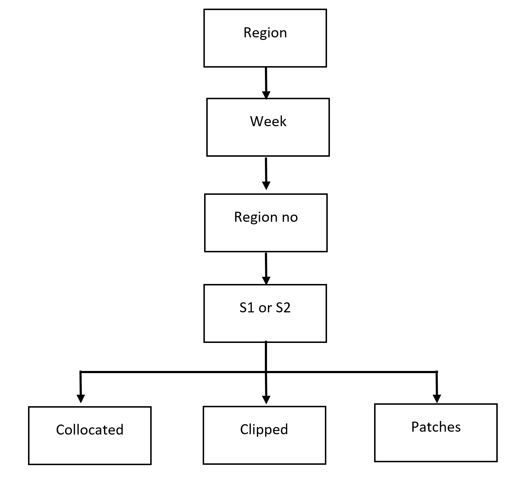

# Naming Conventions
The Sentinel tiles are downloaded at one common place in the folder /var/satellite-data/ to avoid redundant copies of the same tiles.

The folders are made according to the following image.

**TODO** update this image to match new conventions.

The patches are saved in the following folder /var/satellite-data/Sentinel_Patches which include the 

1. Collocated
2. Clipped
3. Patches

All files are stored under a parent directory for a region, `REGION_DIR`. Each product is assigned to a folder based on the *nearest previous monday* (i.e. if the user selects a Wednesday, the folder will be named using the Monday 2 days before).

    REGION_DIR = /var/satellite-data/Sentinel_Patches/<Region_name>/NEAREST_MONDAY/

The collocated tiles are stored in the following manner

    <REGION_DIR>/ROI<ROI_no>/S1/01_Collocated/S1_<S1_product_id>_S2_<S2_product_id>.tif

For example,

    <REGION_DIR>/ROI1/S1/01_Collocated/S1_2c522712-e4a5-4bec-a828-4c8d5c0930f4_S2_b79201de-eb46-49d1-b084-a5b6f974aa55.tif

The clipped tiles are stored in the following manner

    <REGION_DIR>/ROI_<ROI_no>/S1/02_Clipped/S1_roi<ROI_no>_<S1_product_id>.tif   

For example,

    <REGION_DIR>/ROI1/S1/02_Clipped/S1_roi1_2c522712-e4a5-4bec-a828-4c8d5c0930f4.tif   

The generated patches are stored in the following manner

    <REGION_DIR>/ROI_<ROI_no>/S1/03_Patches/S1_<S1_product_id>_<S2_product_id>_<start_row_pixel>x<start_column_pixel>.tif   

For example,

    <REGION_DIR>/ROI1/S1/03_Patches/S1_2c522712-e4a5-4bec-a828-4c8d5c0930f4_S2_8a9cbfaa-1a59-4dd4-ad28-5ee48cc5866e_0_0_256x256.tif   

